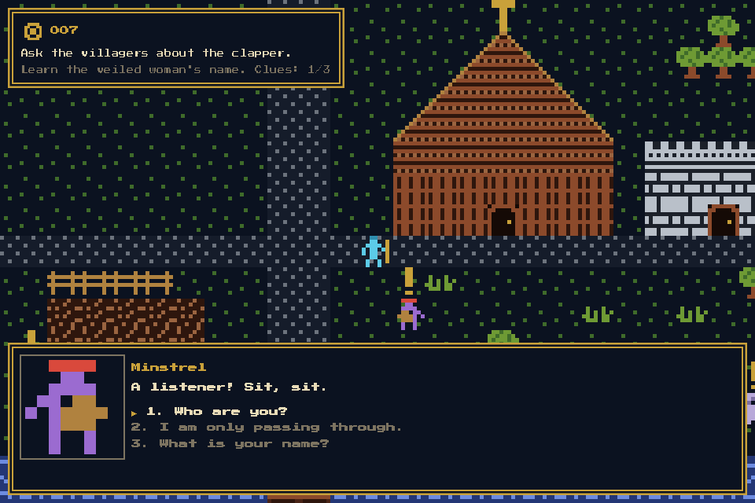

# Ashford — The Silent Bell

A small story RPG in TypeScript. It has 1-bit tile art, branching talk
in TypeScript or [ink](https://www.inklestudios.com/ink/), a side quest,
and three endings. There are no image files: every sprite is an 8x8 grid
of characters in code.

**Play it:** https://knownasilya.github.io/ashford/



```bash
npm install
npm run dev
```

Arrows / WASD move. Space, E or Enter talks. 1–9 picks a choice.

## The story

1257 AD. You are a pilgrim who has walked into Ashford. Three nights ago,
someone took the clapper from the church bell. Old Osric rang that bell
for forty years, until Brother Aldric gave the rope to young Wren.

**The old keep.** Part of its wall has fallen across the gate. You can hear
someone trapped inside, but you need help: ask Tobin and Hal, and they
dig him out.

**Tobin's forge.** It has gone cold. His son Col, who keeps the fire, lies
sick at Hollin Farm east of town. Carry wood from the farm to the smithy,
one heavy bundle at a time (you walk slower while carrying it).

**Side quest — the veiled woman.** She will not tell you her name. She
moves each time she slips away (village, then keep, then church). Mara,
Aldric and Bryn each hold one clue. Guess right and she tells you who she is.

There are three ways to finish:

| Ending | How |
| --- | --- |
| **Two Hands on the Rope** | Learn why Osric took it (Aldric), learn Wren is afraid (Wren), then tell Osric. |
| **The Bell Rings** | Threaten Osric until he hands the clapper over. |
| **A New Voice** | Bring Tobin 3 bundles of wood for his forge, then pay him 10 coins to forge a new clapper. |

## What the engine gives you

| Element | Where | Notes |
| --- | --- | --- |
| Scenes and maps | `src/story/scenes.ts` | ASCII maps. The legend is in `src/engine/tiles.ts`. Roofs, chimneys, smoke and the cross are an overhead layer: you walk behind them. A story can add its own tiles (`src/story/tiles.ts`), and a tile's sprite can depend on the state: the smithy smokes only while the forge burns. |
| Doors and exits | `warps` in a scene | Step on the tile to change scene. `when` + `locked` make a locked door. |
| Characters | `src/story/characters/*.ts` | One file per character: sprite, voice pitch, dialogue. |
| Branching talk (TS) | `Dialogue` nodes | Lines, choices, conditions (`when`), effects (`do`). |
| Branching talk (ink) | `src/story/ink/*.ink` | Set `ink: 'knot'` on an actor. See "Ink" below. |
| Names | `role`, `introduce` | A person shows as their role, or "???", until you learn their name. |
| Memory | `GameState` | `s.set('flag')`, `s.has('flag')`, `s.give('item')`, `s.coins`, counters with `s.add('name')` / `s.count('name')`. |
| Walking speed | `Story.playerSpeed` | For example, slower while carrying something heavy. |
| Actors that move | `Placement.when` | Osric leaves the keep and waits in the church once `osric_coming` is set. |
| Markers | `ActorDef.marker` | `!` until you first talk to someone. `?` when they have something new. |
| Cutscenes | `src/story/cutscenes.ts` | Steps: `card`, `fade`, `move`, `face`, `say`, `talk`, `ink`, `warp`, `wait`, `sound`, `shake`, `end`. |
| Scene entry events | `SceneDef.onEnter` | A list of cutscenes, each with `once` and `when`. The keep uses one for the first visit and one for the rescue. |
| Quest log | `src/story/quest.ts` | One HUD line per active quest, worked out from the flags. |
| Endings | `src/story/endings.ts` | Queue a cutscene that ends with `{ end: 'id' }`. |
| Save / Continue | `src/engine/state.ts` | Saves to `localStorage` after each talk and scene change. |
| Sound | `src/engine/audio.ts` | Text blips per voice, a church bell, and short lute tunes (`src/story/music.ts`). No audio files. |

## Ink

Mara, Wren, Bryn and the veiled woman talk in ink. Hal, Aldric, Tobin
and Osric use TypeScript dialogue. Both kinds run in the same talk box.

- `src/story/ink/main.ink` includes the other files. A Vite plugin
  (`vite.config.ts`) compiles it. Ink errors show in the terminal and
  the browser, with file and line.
- An actor with `ink: 'mara'` starts at the `=== mara ===` knot.
- A cutscene step `{ ink: 'keep_enter' }` runs a knot with no actor.
- Tag a line `#who:you`, `#who:<actor id>` or `#who:narrator` to change
  the speaker.
- Ink calls the game through these functions:

  | Function | Does |
  | --- | --- |
  | `flag(name)` / `set_flag(name)` / `clear_flag(name)` | Read and write game flags |
  | `holds(item)` / `give(item)` / `take(item)` | Items |
  | `coins()` / `add_coins(n)` | Money (use a negative n to spend) |
  | `count(name)` / `add_count(name, n)` | Counters shared with TypeScript |
  | `reveal(actor)` | The player learns this person's name |
  | `cutscene(id)` | Play a cutscene when the talk ends |
  | `music(tune)` | Play a short tune from `src/story/music.ts` |

Use ink `VAR`s for things only one character cares about (Mara's mood).
Use game flags for things the quest log or other characters need.
The save file keeps both.

`bryn.ink` is a tour of ink features: visit counts, shuffles, tunnels,
switch blocks, nested choices and variables.

## Names

- `role: 'Smith'` shows until you learn the name. With no role, "???" shows.
- Learn a name with `s.reveal('tobin')` (TS) or `~ reveal("tobin")` (ink).
  Put it where the name is said, or where someone points the person out.
- `introduce: 'Tobin. I am the smith.'` adds a "What is your name?" choice
  while the name is unknown. Leave it out for people who will not say.

## Common tasks

**Add a character.** Copy `src/story/characters/tobin.ts` (TS dialogue)
or `wren.ts` plus `ink/wren.ink` (ink). Change the id, name, role and sprite. Add it to the `actors` list in `src/story/index.ts`.
Place it in a scene's `actors` list.

**Add a scene.** Add a `SceneDef` to `src/story/scenes.ts` and a warp that
leads to it. All rows of a map must be the same width. The game throws a
clear error if they are not.

**Add a sprite.** Add an 8x8 entry to `SPRITES` in `src/engine/sprites.ts`.
`.` is empty. Letters are colours from `PALETTE` or from the sprite's own
`colors`. Two frames make it animate.

**Start a cutscene from talk.** In TS, `do: (s) => s.queue('my_cutscene')`.
In ink, `~ cutscene("my_cutscene")`. It plays when the talk closes.

**Add a quest log line.** Edit `src/story/quest.ts`. It returns one line
per active quest.

## Debugging

In dev mode the browser console has `ashford`:

```js
ashford.state.flags          // what the story knows
ashford.state.set('quest')   // cheat a flag
ashford.world.load('keep', 9, 12)  // jump to a scene
```

You can also open the dev server straight into a scene. It skips the
title, sets flags, and can start a talk:

```
http://localhost:5173/?scene=village&x=22&y=12&flags=quest,veil_met&talk=bryn
```

## Layout

```
src/
  engine/   generic RPG code (reuse it for any story)
  story/    Ashford: scenes, characters, cutscenes, endings
    ink/    ink conversations
  main.ts   game loop and flow between modes
```
